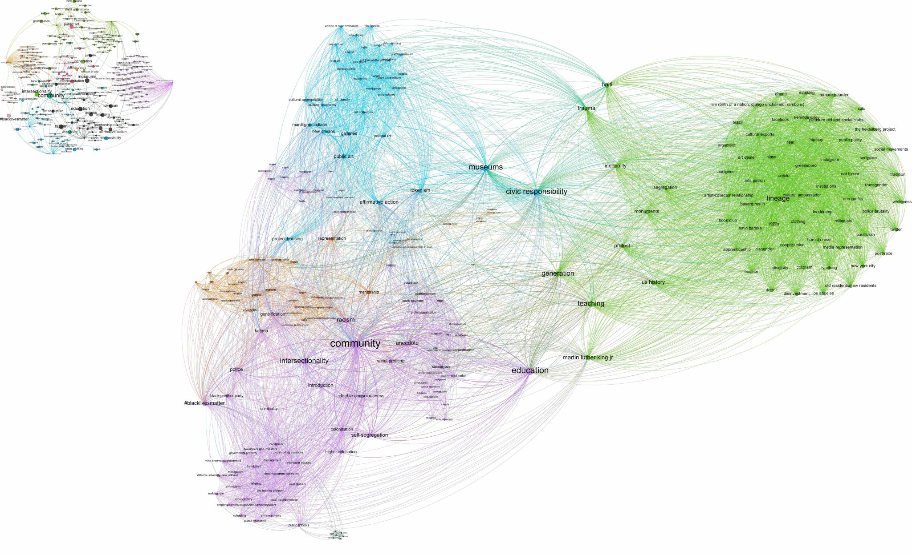
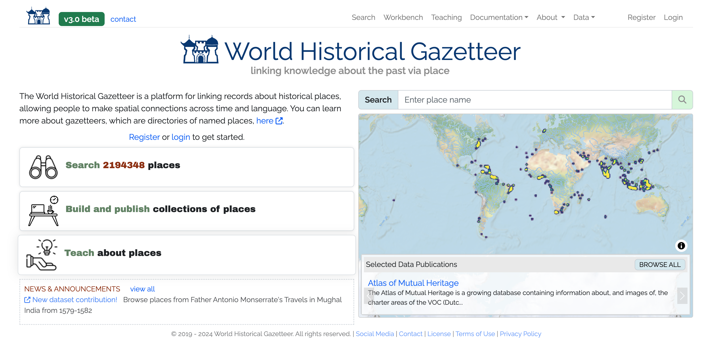

  

## Community Archives

  

### [Visual and Sonic Landscapes of Muslims in Los Angeles](https://fowler.ucla.edu/vsl/muslims-in-los-angeles/)
Working in a collabiration between the Office of Advanced Research Computing and the Fowler Museum, I am the web developer and data designer / modeler for *Visual and Sonic Landscapes of Muslims in Los Angeles*, "...an effort to create a public space for self-representation and self-definition for Muslim Angelenos by Muslim Angelenos. A focus on community voices and ritual, music, murals, and other artworks as primary source materials defines this project."

 
 

  

### [The Black Lunch Table](https://blacklunchtable.com/)
This is an interdisciplinary project that studies cultural production and critical dialogue on racial issues. Started as a collaboration between UNC professors and working artists, Black Lunch Table brings together groups of African-American artists, academics, and activists throughout the United States. These groups have set dialogue topics, and the ensuing conversation is electronically archived and will be presented on an open access website. I led the design and development of new digital humanities methodologies and software for the project, including a combination of social network analysis and natural language processing to create innovative interfaces to catalog, search, and visualize the Black Lunch Table audio archives.
 
 

## Digital Archives

### [Sinai Manuscripts Digital Library](https://sinaimanuscripts.library.ucla.edu/)
Working in a collabiration with UCLA, an international team, and St. Catherine’s Monastery of the Sinai, I was the Data and Workflows Manager for *The Sinai Manuscripts Digital Library*, an online application that hosts "...the results of the Sinai Library Digitization Project, a ten-year collaborative effort to digitize the unparalleled manuscript library of St. Catherine’s Monastery."

 
 

## Digital Gazetteers

  

### [The Pleiades Project](https://pleiades.stoa.org/)  
I am an editor for the [Pleiades Project,](http://pleiades.stoa.org/) a gazetteer and graph offering authoritative data on over 36,000 sites in the ancient world. In addition to my [content and editorial contributions,](http://pleiades.stoa.org/search?Creator=rmhorne&sort_on=created&sort_order=reverse) I have been working extensively on applying network analysis to the data set, creating new cartographical approaches to mapping place data, dealing with uncertainty, and creating new methods for exploring and representing the connectivity between places.

  

### [World Historical Gazetteer](https://whgazetteer.org/)  
As a post-doc researcher I was part of the team that did initial planning, design, and development for the NEH winning [World Historical Gazetteer](https://whgazetteer.org/), "...a platform for linking records about historical places, allowing people to make spatial connections across time and language." With over 2 million place records, the WHG is one of the premier sources for historical place names and spatial information.

  

### [Big Ancient Mediterranean (BAM)](http://bam.lib.uiowa.edu/)  
BAM is an open-access project that integrates GIS tools, network analysis, and textual annotation/data mining capabilities in order to allow the exploration and visualization of ancient texts in new ways. BAM provides a modular framework which can be utilized by any number of different projects, and I have used the codebase to construct projects covering subjects ranging from the ancient world to today. I am also using BAM to explore methods to visualize and display data that is a mix of locatable and non-locatable entities. You can download the code here: [https://github.com/Big-Ancient-Mediterranean/BAM](https://github.com/Big-Ancient-Mediterranean/BAM).

## Network Analysis
::: {layout-ncol=2}

### UNC Knowledge Networks  
 
This project, developed for the [Institute for the Arts and Humanities](http://iah.unc.edu/) at UNC Chapel Hill, identified previously unknown communities of common research interests at the university. It uses [Library of Congress Subject Headings](http://id.loc.gov/authorities/subjects) to categorize common faculty research interests, and deployed the Louvain method for community detection.

### Women of Ancient History (WOAH)   
    
I created the initial functional prototype of WOAH. This project aims to provide accurate information on research interests and knowledge networks of women who study ancient history, in part to counteract the field's prevalent gender imbalance found in academic conferences and publications. It is built on a crowd-sourced data set, and deployed the BAM software suite to highlight common research interests and the geographical distribution of women at institutes of higher education.
:::

## Web Applications
::: {layout-ncol=2}
### [Antiquity À-la-carte application](http://awmc.unc.edu/awmc/applications/alacarte/)  
  
This is a web-based GIS interface and interactive digital atlas of the [ancient world](http://en.wikipedia.org/wiki/Ancient_history), featuring accurate historical, cultural, and geographical data produced by the [AWMC](http://awmc.unc.edu/) in addition to the entire [Pleiades Project](http://pleiades.stoa.org/) feature set. The map is completely searchable with customizable features, allowing for the creation of any map covering [Archaic Greece](http://en.wikipedia.org/wiki/Archaic_Greece) to [Late Antiquity](http://en.wikipedia.org/wiki/Late_Antiquity) and beyond.  Click [here](http://awmc.unc.edu/awmc/applications/alacarte/) or on the image above in order to launch the map application. This application works best with [Firefox](http://www.mozilla.org/en-US/firefox/new/), [Chrome](https://www.google.com/intl/en/chrome/browser/), or [Safari](http://www.apple.com/safari/ "Safari"). The application is hosted on a custom installation of [Mapserver](http://mapserver.org/), and is built with [OpenLayers](http://openlayers.org/), [GeoExt](http://www.geoext.org/), and [MapFish](http://mapfish.org/), with a [PostGIS](http://postgis.refractions.net/) backend. For the use of À-la-carte in scholarship, see Kurt A. Raaflaub and John T. Ramsey, [_Reconstructing the Chronology of Caesar’s Gallic Wars_](http://research.ncl.ac.uk/histos/documents/2017AA01RaaflaubRamsey.pdf), Histos 11, April 2017.

### [Social Networks and Greek Garrisons](http://awmc.unc.edu/awmc/applications/snagg/)  
(http://awmc.unc.edu/awmc/applications/snagg/)
This is a web-mapping application in support of my dissertation that catalogs all known ancient Greek garrisons (_phrourai, phrouria,_ and _phrouroi_) and their commanders. There is a social network graph accompanying the map that is a work-in-progress; this will be finalized as a module that uses the [BAM framework](https://bigancientmediterranean.wordpress.com/).

### [Strabo Online](http://awmc.unc.edu/awmc/applications/strabo/)  
  
Made to accompany  Duane W. Roller’s English translation of Strabo’s _Geography_ ( ISBN: [9781107038257](http://www.worldcat.org/oclc/880860295); [e-book](http://www.cambridge.org/us/academic/subjects/classical-studies/ancient-history/geography-strabo-english-translation-introduction-and-notes?format=AR) ISBN: 9781139950374), this is a seamless, interactive online map which is accessible for free here:  [http://awmc.unc.edu/awmc/applications/strabo](http://awmc.unc.edu/awmc/applications/strabo/).  The application is built on the [Antiquity À-la-carte interface](http://awmc.unc.edu/wordpress/alacarte/), and plots the more than 3,000 locatable geographical and cultural features mentioned in the 17 books of this Greek source , stretching from Ireland to the Ganges delta and deep into north Africa. Like the [Antiquity À-la-carte application](http://awmc.unc.edu/awmc/applications/alacarte/), Strabo Online is hosted on a custom installation of [Mapserver](http://mapserver.org/), and is built with [OpenLayers](http://openlayers.org/), [GeoExt](http://www.geoext.org/), and [MapFish](http://mapfish.org/), with a [PostGIS](http://postgis.refractions.net/) backend and [DataTables](http://datatables.net/) to assist with the presentation of the database.

### [Peutinger Map A](http://peutinger.atlantides.org/map-a/)
  
I finished a codebase originally begun by David O’Brien and Sean Gillies in support of Richard J.A. Talbert, _[Rome's World: The Peutinger Map Reconsidered](http://www.worldcat.org/oclc/387788638)_ (Cambridge University Press, 2010). [This viewer](http://peutinger.atlantides.org/map-a/) shows the [Peutinger Map](http://en.wikipedia.org/wiki/Tabula_Peutingeriana) as a seamless whole, in color, with overlaid layers. The application is built with the [Djatkoa JPEG 2000 Image Server](http://sourceforge.net/projects/djatoka/) and [OpenLayers](http://openlayers.org/).

### [The AWMC API](http://awmc.unc.edu/api/)  
(http://awmc.unc.edu/api/)  
:** This allows the user access to all of the [AWMC](http://awmc.unc.edu/)'s geographical information, both physical and cultural, using stable URIS. It is built with [OpenLayers](http://openlayers.org/), [PostGIS](http://postgis.refractions.net/), and [DataTables](http://datatables.net/), with styling from WordPress and BuddyPress. It interfaces with the [Pelagios Project](http://pelagios-project.blogspot.com/) using linked data principles, specifically through RDF. For a full explanation of how this was accomplished, [please see this post](http://pelagios-project.blogspot.com/2013/01/the-ancient-world-mapping-center.html).

### [Hierokles, Synekdemos](http://awmc.unc.edu/awmc/applications/hierokles/)  
    
The Center’s single, interactive web map follows the text of Hierokles, Synekdemos in Ernest Honigmann’s edition (Brussels, 1939), and aims to supersede his four maps.  With the Center’s Map Tiles as its base, the map marks all cities and regions which may identified and located with at least some confidence according to the Barrington Atlas and related publications listed below.  Greek names are transliterated as in the Barrington Atlas (see Directory, p. vii).  A full database lists all the place-names in the Synekdemos with references (thus including those that cannot be located and marked on the map).  In addition, the text of Honigmann’s edition of the Synekdemos (and of the geographic work of George of Cyprus) is accessible via the Center’s Dropbox.
:::

## Geographic Information Systems
::: {layout-ncol=2}
### [AWMC Map tiles](http://awmc.unc.edu/wordpress/tiles/)  
  
Offering the first (and at the time of this writing, only) geographically accurate base map of the ancient world, the AWMC tiles conform to the broad periodization presented in the _[Barrington Atlas](http://www.worldcat.org/oclc/43970336)_, with different selectable water levels for the [Archaic](http://en.wikipedia.org/wiki/Archaic_Greece), [Classical](http://en.wikipedia.org/wiki/Classical_Greece), [Hellenistic](http://en.wikipedia.org/wiki/Hellenistic_period), [Roman](http://en.wikipedia.org/wiki/Roman_Empire), and [Late Antique](http://en.wikipedia.org/wiki/Late_Antiquity) Periods. In addition, we also model inland water, rivers, and other geographical features as they appeared in antiquity. The base tiles are culturally agnostic, allowing them to be used to represent the physical environment of nearly any ancient society in the [Mediterranean](http://pleiades.stoa.org/places/1043) world.  
  These tiles are used by [Pleiades](http://pleiades.stoa.org/), [Harvard's Digital Atlas of Roman and Medieval Civilizations](http://darmc.harvard.edu/icb/icb.do), [Stanford's ORBIS application](http://orbis.stanford.edu/), and the [Istituto di Studi sul Mediterraneo Antico](http://www.isma.cnr.it/), amongst others.
:::

## Print Maps

::: {layout-ncol=2}
[Hispania](http://pleiades.stoa.org/places/1027) in the Second Century C.E**: At 1:750,000, scale and measuring 58.5 inches tall by 68 inches (149 by 173 cm), this map is a new addition to the AWMC's class map series, and it will be offered as a stand-alone product. More information is available from the [flier linked here](http://awmc.unc.edu/wordpress/wp-content/uploads/2014/12/aia_final.pdf). A Draft Map was displayed at the Poster Session of the [AIA New Orleans meeting](http://www.archaeological.org/annualmeeting), Friday 9 January 2015, 10:45 am to 3: 00 pm.

[Asia Minor](https://pleiades.stoa.org/places/837) in the Second Century C.E**.: Like the map of Hispania, this map is produced at 1:750,000 scale, and is offered as a [free download through the AWMC website](http://awmc.unc.edu/wordpress/blog/2017/02/22/wall-map-now-available-asia-minor-in-the-second-century-c-e/). As a collaborative work, this map represents the current state of knowledge concerning Roman Anatolia, and was took several years to produce at the center. A draft of the map was presented by Richard Talbert at the ‘Roads and Routes in Anatolia’ conference organized by the British Institute at Ankara in March 2014.

:::

**[Benthos](http://awmc.unc.edu/wordpress/benthos/):**  Currently in the Alpha stage, [Benthos](http://awmc.unc.edu/wordpress/benthos/) is a project of the [Ancient World Mapping Center](http://awmc.unc.edu/) that aims to catalog and map the waters of the ancient Mediterranean basin, including both physical and cultural geography. The project will provide interactive maps of [Mediterranean](http://pleiades.stoa.org/places/1043) shipping networks, [bathymetric](http://en.wikipedia.org/wiki/Bathymetric) data, and views of ancient coastlines. Currently the project is in a preliminary state, with a functional [alpha version](http://en.wikipedia.org/wiki/Software_release_life_cycle) of the application based off of [Antiquity À-la-carte](http://awmc.unc.edu/wordpress/alacarte/).

Click [here](http://awmc.unc.edu/awmc/applications/benthos/) or on the image above in order to launch the map application. This application works best with [Firefox](http://www.mozilla.org/en-US/firefox/new/), [Chrome](https://www.google.com/intl/en/chrome/browser/), or [Safari](http://www.apple.com/safari/ "Safari").

* * *

**[Pleiades Project](http://pleiades.stoa.org/)**: Although I do not work with the code of the site, I am a [co-managing editor](http://pleiades.stoa.org/news/blog/ryan-horne-assumes-co-managing-editor-role)

Through my work at the Ancient World Mapping Center I participated in the creation of numerous print maps for research, classroom use, and traditional publications. Some highlights are below.

